# Corporate Policy Database Schema & ER Diagram DDL

This document provides a comprehensive view of the database schema for the Corporate Policy application. It includes a visual **ER Diagram** (written in Mermaid syntax) and the clean, copy-pasteable **PostgreSQL DDL SQL Queries** required to recreate the database tables, constraints, indexes, and foreign key relationships.

---

## 1. Visual ER Diagram (Mermaid)

The following Mermaid diagram visualizes the primary relationships between Core Users, Corporates, Policies, CD Accounts, Claims, and Employee/Data Upload mapping tables.

```mermaid
erDiagram
    users {
        bigint id PK
        varchar email_address UK
        varchar first_name
        varchar last_name
        varchar full_name
        varchar mobile_no
        varchar gender
        date dob
        bigint ref_corporate_id FK
        bigint ref_md_department_id
        bigint ref_reporting_id FK
        varchar department_name
        varchar location
        integer onboarding_status_id
        varchar reporting
        varchar designation
        varchar assign_corporate
        integer test_user
        varchar corporate_username UK
    }

    master_corporates {
        bigint corporate_id PK
        varchar corporate_name
        integer ref_master_corporate_logos_id
        varchar coporate_contact_email
        varchar corporate_landline
        integer ref_master_pincode_pincode_id
        integer ref_master_city_city_id
        integer ref_master_state_state_id
        varchar corporate_address
        varchar corporate_group_code
        varchar industry_type
        integer corporate_buffer_visibility
        integer corporate_status
        varchar pincode
        varchar city
        varchar state
        varchar helpline_no
        varchar pan_number
        varchar branch_name
    }

    master_add_policies {
        bigint id PK
        varchar corporate_name
        bigint ref_corporate_id FK
        bigint ref_md_line_of_businesses_id FK
        varchar line_of_business
        bigint ref_md_policy_types_id FK
        varchar policy_type
        bigint ref_md_sum_insured_types_id FK
        varchar sum_insured_type
        bigint ref_select_insurer_id FK
        varchar select_insurer
        text select_tpa
        bigint ref_tpa_id FK
        integer have_policy_number
        varchar policy_number
        date policy_start_date
        date policy_end_date
        bigint ref_md_family_definitions_id FK
        varchar family_definition
        bigint ref_md_claim_submission_visibilities_id
        text claim_submission_additional_email
        bigint ref_intimate_claim_visibilities_id FK
        varchar intimate_claim_visibility
        integer status
        bigint user_id
        bigint ref_fy_year_id FK
        bigint created_by FK
        bigint updated_by FK
        varchar policy_number_identifier
    }

    master_claim_submission {
        bigint id PK
        integer ref_corporate_id FK
        bigint ref_policy_id FK
        integer portal_id
        varchar claim_number UK
        varchar intimation_number UK
        varchar corporate_name
        varchar policy_number
        varchar policy_type
        varchar insurer_name
        varchar tpa_name
        varchar employee_code
        varchar employee_name
        varchar patient_name
        varchar relationship
        decimal estimated_amount
        text claim_reason
        varchar claim_type
        varchar hospital_name
        text hospital_address
        date hospitalization_date
        date discharge_date
        varchar city
        varchar state
        varchar pincode
        text treatment_details
        text remarks
        varchar claim_status
        timestamp submitted_at
        bigint submitted_by
        bigint created_by FK
        bigint updated_by FK
    }

    master_claim_submission_documents {
        bigint id PK
        bigint claim_id FK
        integer policy_id
        varchar document_name
        varchar original_file_name
        varchar file_path
        varchar mime_type
        integer file_size
        integer status
        bigint created_by FK
        bigint updated_by FK
    }

    trn_mapping_live_employees {
        bigint id PK
        bigint ref_policy_id FK
        bigint ref_corporate_id FK
        varchar employee_code
        varchar employee_name
        varchar gender
        varchar relationship
        varchar dob
        integer age
        varchar mobile_number
        varchar email
        float sum_insured
        varchar doj
        varchar endorsement_number
        varchar endorsement_date
        varchar endorsement_type
        varchar dol
        varchar member_card_number
        varchar designation
        varchar status
        varchar source_type
        integer created_by
        integer updated_by
    }

    master_cd_accounts {
        bigint id PK
        varchar cd_name
        varchar cd_number UK
        bigint ref_corporate_id FK
        varchar corporate_name
        bigint ref_policy_id FK
        varchar policy_number
        bigint ref_insurer_id FK
        varchar insurer_name
        integer status
        bigint created_by FK
        bigint updated_by FK
    }

    master_policy_cd_statements {
        bigint id PK
        varchar corporate_name
        integer corporate_id FK
        varchar cd_number
        integer cd_account_id FK
        varchar data_upload_file
        integer policy_id FK
        boolean is_dataupload
        bigint created_by FK
        bigint updated_by FK
    }

    master_cd_statement_data_uploads {
        bigint id PK
        bigint ref_policy_cd_statement_id FK
        varchar particular
        varchar transaction_type
        integer employee_count
        integer dependant_count
        varchar policy_endorsement_no
        varchar endorsement_issued_date
        decimal debit_amount
        decimal credit_amount
        varchar bank_name
        varchar cheque_no
        varchar policy_number
        text remark
        varchar corporate_name
        bigint corporate_id FK
        bigint policy_id FK
        varchar cd_number
        integer status
        bigint created_by FK
        bigint updated_by FK
    }

    users ||--o| master_corporates : "belongs to"
    users ||--o| users : "reports to"
    master_add_policies ||--|| master_corporates : "links to"
    master_claim_submission ||--|| master_corporates : "links to"
    master_claim_submission ||--|| master_add_policies : "links to"
    master_claim_submission_documents ||--|| master_claim_submission : "belongs to"
    trn_mapping_live_employees ||--|| master_add_policies : "links to"
    trn_mapping_live_employees ||--|| master_corporates : "links to"
    master_cd_accounts ||--|| master_corporates : "belongs to"
    master_cd_accounts ||--|| master_add_policies : "belongs to"
    master_policy_cd_statements ||--|| master_corporates : "belongs to"
    master_policy_cd_statements ||--|| master_add_policies : "belongs to"
    master_policy_cd_statements ||--|| master_cd_accounts : "belongs to"
    master_cd_statement_data_uploads ||--|| master_policy_cd_statements : "belongs to"
    master_cd_statement_data_uploads ||--|| master_add_policies : "links to"
    master_cd_statement_data_uploads ||--|| master_corporates : "links to"
```



---

## 2. PostgreSQL DDL SQL Queries

Below are the complete and clean SQL statements to recreate the database tables.

### 2.1 Users & Core Authentication
```sql
CREATE TABLE public.users (
    id bigint NOT NULL GENERATED BY DEFAULT AS IDENTITY,
    first_name character varying(255) NOT NULL,
    last_name character varying(255) NOT NULL,
    email_address character varying(255) NOT NULL,
    password character varying(255) NOT NULL,
    status integer DEFAULT 0 NOT NULL,
    remember_token character varying(255),
    deleted_at timestamp without time zone,
    inserted_at timestamp without time zone NOT NULL,
    updated_at timestamp without time zone NOT NULL,
    mobile_no character varying(20),
    full_name character varying(255),
    gender character varying(20),
    dob date,
    ref_corporate_id bigint,
    ref_md_department_id bigint,
    department_name character varying(50),
    location character varying(100),
    onboarding_status_id integer DEFAULT 0,
    reporting character varying(100),
    ref_reporting_id bigint,
    designation character varying(100),
    assign_corporate character varying(100),
    test_user integer DEFAULT 0,
    corporate_username character varying(100),
    department_id integer,
    CONSTRAINT users_pkey PRIMARY KEY (id),
    CONSTRAINT users_email_address_key UNIQUE (email_address),
    CONSTRAINT users_corporate_username_key UNIQUE (corporate_username)
);
```

### 2.2 Corporates Profile
```sql
CREATE TABLE public.master_corporates (
    corporate_id bigint NOT NULL GENERATED BY DEFAULT AS IDENTITY,
    corporate_name character varying(255) NOT NULL,
    ref_master_corporate_logos_id integer,
    coporate_contact_email character varying(255),
    corporate_landline character varying(255),
    ref_master_pincode_pincode_id integer DEFAULT 0 NOT NULL,
    ref_master_city_city_id integer DEFAULT 0 NOT NULL,
    ref_master_state_state_id integer DEFAULT 0 NOT NULL,
    corporate_address character varying(255) NOT NULL,
    corporate_group_code character varying(255),
    industry_type character varying(255),
    corporate_buffer_visibility integer DEFAULT 0 NOT NULL,
    corporate_status integer DEFAULT 1 NOT NULL,
    pincode character varying(10) DEFAULT ''::character varying NOT NULL,
    city character varying(25) DEFAULT ''::character varying NOT NULL,
    state character varying(25) DEFAULT ''::character varying NOT NULL,
    helpline_no character varying(255),
    pan_number character varying(15),
    branch_name character varying(255),
    deleted_at timestamp without time zone,
    inserted_at timestamp without time zone NOT NULL,
    updated_at timestamp without time zone NOT NULL,
    CONSTRAINT master_corporates_pkey PRIMARY KEY (corporate_id)
);
```

### 2.3 Master Policies
```sql
CREATE TABLE public.master_add_policies (
    id bigint NOT NULL GENERATED BY DEFAULT AS IDENTITY,
    corporate_name character varying(100) NOT NULL,
    ref_corporate_id bigint NOT NULL,
    ref_md_line_of_businesses_id bigint NOT NULL,
    line_of_business character varying(100) NOT NULL,
    ref_md_policy_types_id bigint NOT NULL,
    policy_type character varying(100) NOT NULL,
    ref_md_sum_insured_types_id bigint,
    sum_insured_type character varying(100),
    ref_select_insurer_id bigint NOT NULL,
    select_insurer character varying(255) NOT NULL,
    select_tpa text,
    ref_tpa_id bigint,
    have_policy_number integer DEFAULT 0 NOT NULL,
    policy_number character varying(100),
    policy_start_date date,
    policy_end_date date,
    ref_md_family_definitions_id bigint,
    family_definition character varying(100),
    ref_md_claim_submission_visibilities_id bigint DEFAULT 0,
    claim_submission_additional_email text,
    ref_intimate_claim_visibilities_id bigint,
    intimate_claim_visibility character varying(50),
    status integer DEFAULT 0 NOT NULL,
    user_id bigint,
    ref_fy_year_id bigint NOT NULL,
    created_by bigint,
    updated_by bigint,
    inserted_at timestamp without time zone NOT NULL,
    updated_at timestamp without time zone NOT NULL,
    policy_number_identifier character varying(100),
    CONSTRAINT master_add_policies_pkey PRIMARY KEY (id)
);
```

### 2.4 CD Accounts & Statements
```sql
CREATE TABLE public.master_cd_accounts (
    id bigint NOT NULL GENERATED BY DEFAULT AS IDENTITY,
    cd_name character varying(100) NOT NULL,
    cd_number character varying(100) NOT NULL,
    ref_corporate_id bigint NOT NULL,
    corporate_name character varying(100) NOT NULL,
    ref_insurer_id bigint NOT NULL,
    insurer_name character varying(100) NOT NULL,
    status integer DEFAULT 0 NOT NULL,
    inserted_at timestamp without time zone NOT NULL,
    updated_at timestamp without time zone NOT NULL,
    ref_policy_id bigint,
    policy_number character varying(100),
    deleted_at timestamp(6) with time zone,
    created_by bigint,
    updated_by bigint,
    CONSTRAINT master_cd_accounts_pkey PRIMARY KEY (id),
    CONSTRAINT master_cd_accounts_corporate_policy_number_unique UNIQUE (ref_corporate_id, ref_policy_id, cd_number)
);

CREATE TABLE public.master_policy_cd_statements (
    id bigint NOT NULL GENERATED BY DEFAULT AS IDENTITY,
    corporate_name character varying(255) NOT NULL,
    corporate_id integer NOT NULL,
    cd_number character varying(255) NOT NULL,
    cd_account_id integer NOT NULL,
    data_upload_file character varying(255),
    policy_id integer,
    is_dataupload boolean DEFAULT true,
    created_by bigint,
    updated_by bigint,
    deleted_at timestamp without time zone,
    inserted_at timestamp without time zone NOT NULL,
    updated_at timestamp without time zone NOT NULL,
    CONSTRAINT master_policy_cd_statements_pkey PRIMARY KEY (id)
);

CREATE TABLE public.master_cd_statement_data_uploads (
    id bigint NOT NULL GENERATED BY DEFAULT AS IDENTITY,
    ref_policy_cd_statement_id bigint NOT NULL,
    particular character varying(100),
    transaction_type character varying(50),
    employee_count integer,
    dependant_count integer,
    policy_endorsement_no character varying(150),
    endorsement_issued_date character varying(30),
    debit_amount decimal(15,2),
    credit_amount decimal(15,2),
    bank_name character varying(150),
    cheque_no character varying(30),
    policy_number character varying(100),
    remark text,
    corporate_name character varying(150),
    corporate_id bigint,
    policy_id bigint,
    cd_number character varying(255),
    status integer DEFAULT 0 NOT NULL,
    deleted_at timestamp without time zone,
    created_by bigint,
    updated_by bigint,
    inserted_at timestamp without time zone NOT NULL,
    updated_at timestamp without time zone NOT NULL,
    CONSTRAINT master_cd_statement_data_uploads_pkey PRIMARY KEY (id)
);
```

### 2.5 Claim Submissions & Logs
```sql
CREATE TABLE public.master_claim_submission (
    id bigint NOT NULL GENERATED BY DEFAULT AS IDENTITY,
    ref_corporate_id integer NOT NULL,
    ref_policy_id bigint NOT NULL,
    portal_id integer NOT NULL,
    claim_number character varying(255) NOT NULL,
    intimation_number character varying(255),
    corporate_name character varying(255),
    policy_number character varying(255),
    policy_type character varying(255),
    insurer_name character varying(255),
    tpa_name character varying(255),
    employee_code character varying(255) NOT NULL,
    employee_name character varying(255),
    patient_name character varying(255) NOT NULL,
    relationship character varying(255),
    estimated_amount numeric(12,2) NOT NULL,
    claim_reason text NOT NULL,
    claim_type character varying(255) NOT NULL,
    hospital_name character varying(255) NOT NULL,
    hospital_address text NOT NULL,
    hospitalization_date date NOT NULL,
    discharge_date date NOT NULL,
    city character varying(255) NOT NULL,
    state character varying(255) NOT NULL,
    pincode character varying(255) NOT NULL,
    treatment_details text,
    remarks text,
    claim_status character varying(255) DEFAULT 'Draft'::character varying NOT NULL,
    submitted_at timestamp without time zone,
    submitted_by bigint,
    created_by bigint,
    updated_by bigint,
    deleted_at timestamp without time zone,
    inserted_at timestamp without time zone NOT NULL,
    updated_at timestamp without time zone NOT NULL,
    CONSTRAINT master_claim_submission_pkey PRIMARY KEY (id),
    CONSTRAINT master_claim_submission_claim_number_key UNIQUE (claim_number),
    CONSTRAINT master_claim_submission_intimation_number_key UNIQUE (intimation_number)
);

CREATE TABLE public.master_claim_submission_documents (
    id bigint NOT NULL GENERATED BY DEFAULT AS IDENTITY,
    claim_id bigint NOT NULL,
    policy_id integer NOT NULL,
    document_name character varying(255) NOT NULL,
    original_file_name character varying(255) NOT NULL,
    file_path character varying(255) NOT NULL,
    mime_type character varying(255),
    file_size integer,
    status integer DEFAULT 1,
    created_by bigint,
    updated_by bigint,
    deleted_at timestamp without time zone,
    inserted_at timestamp without time zone NOT NULL,
    updated_at timestamp without time zone NOT NULL,
    CONSTRAINT master_claim_submission_documents_pkey PRIMARY KEY (id)
);

CREATE TABLE public.trp_claim_submission_logs (
    id bigint NOT NULL GENERATED BY DEFAULT AS IDENTITY,
    claim_id bigint NOT NULL,
    policy_id integer NOT NULL,
    portal_id integer NOT NULL,
    action character varying(255) NOT NULL,
    remarks text,
    user_id bigint,
    inserted_at timestamp without time zone NOT NULL,
    submitted_by bigint,
    CONSTRAINT trp_claim_submission_logs_pkey PRIMARY KEY (id)
);
```

### 2.6 Active Employees & Endorsement Data
```sql
CREATE TABLE public.trn_mapping_live_employees (
    id bigint NOT NULL GENERATED BY DEFAULT AS IDENTITY,
    ref_policy_id bigint NOT NULL,
    ref_corporate_id bigint NOT NULL,
    employee_code character varying(255),
    employee_name character varying(255),
    gender character varying(255),
    relationship character varying(255),
    dob character varying(255),
    age integer,
    mobile_number character varying(255),
    email character varying(255),
    sum_insured double precision,
    doj character varying(255),
    endorsement_number character varying(255),
    endorsement_date character varying(255),
    endorsement_type character varying(255),
    dol character varying(255),
    member_card_number character varying(255),
    designation character varying(255),
    status character varying(255) DEFAULT 'active'::character varying,
    source_type character varying(255),
    created_by integer,
    updated_by integer,
    deleted_at timestamp without time zone,
    inserted_at timestamp without time zone NOT NULL,
    updated_at timestamp without time zone NOT NULL,
    CONSTRAINT trn_mapping_live_employees_pkey PRIMARY KEY (id),
    CONSTRAINT unique_policy_live_employee_relationship_index UNIQUE (ref_policy_id, employee_code, relationship)
);

CREATE TABLE public.trn_endorsement_deletion_logs (
    id bigint NOT NULL GENERATED BY DEFAULT AS IDENTITY,
    ref_policy_id bigint NOT NULL,
    ref_corporate_id bigint NOT NULL,
    employee_code character varying(255),
    employee_name character varying(255),
    relationship character varying(255),
    endorsement_number character varying(255),
    endorsement_date character varying(255),
    endorsement_type character varying(255),
    deletion_category character varying(255) DEFAULT 'Dependant Deletion'::character varying,
    deleted_at timestamp without time zone,
    created_by integer,
    updated_by integer,
    inserted_at timestamp without time zone NOT NULL,
    updated_at timestamp without time zone NOT NULL,
    upload_id bigint,
    action character varying(255),
    CONSTRAINT trn_endorsement_deletion_logs_pkey PRIMARY KEY (id)
);
```

### 2.7 General Metadata & Reference Tables
```sql
CREATE TABLE public.md_line_of_businesses (
    id bigint NOT NULL GENERATED BY DEFAULT AS IDENTITY,
    name character varying(255) NOT NULL,
    status integer DEFAULT 0 NOT NULL,
    inserted_at timestamp without time zone NOT NULL,
    updated_at timestamp without time zone NOT NULL,
    CONSTRAINT md_line_of_businesses_pkey PRIMARY KEY (id)
);

CREATE TABLE public.md_policy_types (
    id bigint NOT NULL GENERATED BY DEFAULT AS IDENTITY,
    name character varying(255) NOT NULL,
    status integer DEFAULT 0 NOT NULL,
    inserted_at timestamp without time zone NOT NULL,
    updated_at timestamp without time zone NOT NULL,
    ref_md_line_of_businesses_id bigint,
    CONSTRAINT md_policy_types_pkey PRIMARY KEY (id)
);

CREATE TABLE public.md_insurer_lists (
    id bigint NOT NULL GENERATED BY DEFAULT AS IDENTITY,
    name character varying(255) NOT NULL,
    status integer DEFAULT 0 NOT NULL,
    inserted_at timestamp without time zone NOT NULL,
    updated_at timestamp without time zone NOT NULL,
    ref_md_line_of_businesses_id bigint,
    CONSTRAINT md_insurer_lists_pkey PRIMARY KEY (id)
);

CREATE TABLE public.md_policy_tpas (
    id bigint NOT NULL GENERATED BY DEFAULT AS IDENTITY,
    name character varying(255) NOT NULL,
    status integer DEFAULT 0 NOT NULL,
    inserted_at timestamp without time zone NOT NULL,
    updated_at timestamp without time zone NOT NULL,
    CONSTRAINT md_policy_tpas_pkey PRIMARY KEY (id)
);

CREATE TABLE public.md_financial_years (
    id bigint NOT NULL GENERATED BY DEFAULT AS IDENTITY,
    year_name character varying(50) NOT NULL,
    start_date date NOT NULL,
    end_date date NOT NULL,
    status integer DEFAULT 1 NOT NULL,
    inserted_at timestamp without time zone NOT NULL,
    updated_at timestamp without time zone NOT NULL,
    CONSTRAINT md_financial_years_pkey PRIMARY KEY (id),
    CONSTRAINT md_financial_years_year_name_key UNIQUE (year_name)
);

CREATE TABLE public.md_family_definitions (
    id bigint NOT NULL GENERATED BY DEFAULT AS IDENTITY,
    name character varying(100) NOT NULL,
    display_id integer NOT NULL,
    status integer DEFAULT 0 NOT NULL,
    inserted_at timestamp without time zone NOT NULL,
    updated_at timestamp without time zone NOT NULL,
    CONSTRAINT md_family_definitions_pkey PRIMARY KEY (id)
);

CREATE TABLE public.md_intimate_claim_visibilities (
    id bigint NOT NULL GENERATED BY DEFAULT AS IDENTITY,
    name character varying(100) NOT NULL,
    display_id integer NOT NULL,
    status integer DEFAULT 0 NOT NULL,
    inserted_at timestamp without time zone NOT NULL,
    updated_at timestamp without time zone NOT NULL,
    CONSTRAINT md_intimate_claim_visibilities_pkey PRIMARY KEY (id)
);
```

---

## 3. Foreign Key Constraints

Executing the following queries maps the primary relational paths across all entities:

```sql
-- Policies Relationships
ALTER TABLE ONLY public.master_add_policies
    ADD CONSTRAINT master_add_policies_corporate_id_fkey FOREIGN KEY (ref_corporate_id) REFERENCES public.master_corporates(corporate_id);

-- Claim Submission Relationships
ALTER TABLE ONLY public.master_claim_submission
    ADD CONSTRAINT master_claim_submission_ref_policy_id_fkey FOREIGN KEY (ref_policy_id) REFERENCES public.master_add_policies(id);
ALTER TABLE ONLY public.master_claim_submission
    ADD CONSTRAINT master_claim_submission_created_by_fkey FOREIGN KEY (created_by) REFERENCES public.users(id);
ALTER TABLE ONLY public.master_claim_submission
    ADD CONSTRAINT master_claim_submission_updated_by_fkey FOREIGN KEY (updated_by) REFERENCES public.users(id);

-- Claim Submission Documents Relationships
ALTER TABLE ONLY public.master_claim_submission_documents
    ADD CONSTRAINT master_claim_submission_documents_claim_id_fkey FOREIGN KEY (claim_id) REFERENCES public.master_claim_submission(id) ON DELETE CASCADE;
ALTER TABLE ONLY public.master_claim_submission_documents
    ADD CONSTRAINT master_claim_submission_documents_created_by_fkey FOREIGN KEY (created_by) REFERENCES public.users(id);
ALTER TABLE ONLY public.master_claim_submission_documents
    ADD CONSTRAINT master_claim_submission_documents_updated_by_fkey FOREIGN KEY (updated_by) REFERENCES public.users(id);

-- Claim Logs Relationships
ALTER TABLE ONLY public.trp_claim_submission_logs
    ADD CONSTRAINT master_claim_logs_claim_id_fkey FOREIGN KEY (claim_id) REFERENCES public.master_claim_submission(id) ON DELETE CASCADE;
ALTER TABLE ONLY public.trp_claim_submission_logs
    ADD CONSTRAINT master_claim_logs_user_id_fkey FOREIGN KEY (user_id) REFERENCES public.users(id);

-- Live Employee Data Relationships
ALTER TABLE ONLY public.trn_mapping_live_employees
    ADD CONSTRAINT trn_mapping_live_employees_ref_corporate_id_fkey FOREIGN KEY (ref_corporate_id) REFERENCES public.master_corporates(corporate_id);
ALTER TABLE ONLY public.trn_mapping_live_employees
    ADD CONSTRAINT trn_mapping_live_employees_ref_policy_id_fkey FOREIGN KEY (ref_policy_id) REFERENCES public.master_add_policies(id);

-- Endorsement Deletions Relationships
ALTER TABLE ONLY public.trn_endorsement_deletion_logs
    ADD CONSTRAINT trn_endorsement_deletion_logs_ref_corporate_id_fkey FOREIGN KEY (ref_corporate_id) REFERENCES public.master_corporates(corporate_id);
ALTER TABLE ONLY public.trn_endorsement_deletion_logs
    ADD CONSTRAINT trn_endorsement_deletion_logs_ref_policy_id_fkey FOREIGN KEY (ref_policy_id) REFERENCES public.master_add_policies(id);

-- CD Account Relationships
ALTER TABLE ONLY public.master_cd_accounts
    ADD CONSTRAINT master_cd_accounts_created_by_fkey FOREIGN KEY (created_by) REFERENCES public.users(id);
ALTER TABLE ONLY public.master_cd_accounts
    ADD CONSTRAINT master_cd_accounts_updated_by_fkey FOREIGN KEY (updated_by) REFERENCES public.users(id);

-- Policy CD Statements Relationships
ALTER TABLE ONLY public.master_policy_cd_statements
    ADD CONSTRAINT master_policy_cd_statements_created_by_fkey FOREIGN KEY (created_by) REFERENCES public.users(id);
ALTER TABLE ONLY public.master_policy_cd_statements
    ADD CONSTRAINT master_policy_cd_statements_updated_by_fkey FOREIGN KEY (updated_by) REFERENCES public.users(id);
```
