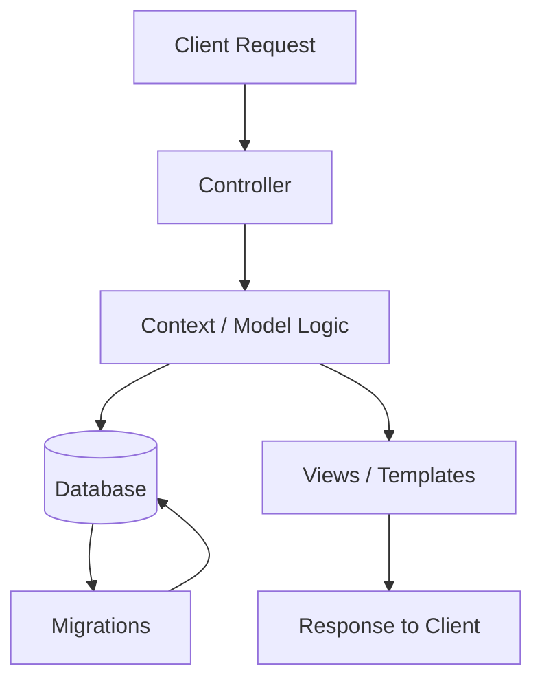

# Project Structure

This file outlines the main Phoenix project structure for controllers, migrations, and model/context files.

## Main folders

```text
lib/
├── corporate_policy/           # Business logic and schemas/contexts
│   └── accounts/               # Example domain module
├── corporate_policy_web/       # Web layer
│   ├── controllers/            # Request handlers
│   ├── live/                  # LiveViews (if used)
│   └── router.ex               # Routes
priv/
└── repo/
    ├── migrations/             # Database migration files
    └── seeds.exs               # Seed data
```

## Key files

- Controllers: `lib/corporate_policy_web/controllers/`
- Contexts / models: `lib/corporate_policy/`
- Migrations: `priv/repo/migrations/`
- Router: `lib/corporate_policy_web/router.ex`

## Mermaid diagram



## Example structure

```text
lib/
  corporate_policy_web/
    controllers/
      session_controller.ex
    employee/                   # Isolated Employee Portal Web files
      controllers/
        employee_session_controller.ex
  corporate_policy/             # Shared Domain Contexts & APIs
    accounts/
      user.ex
    two_factor_client.ex        # 2Factor SMS Client Integration
    employee_portal.ex          # Employee Auth & Portal Queries
priv/
  repo/
    migrations/
      20260709010101_create_users.exs
      20260819074720_add_is_testuser_to_trn_mapping_live_employees.exs
```
